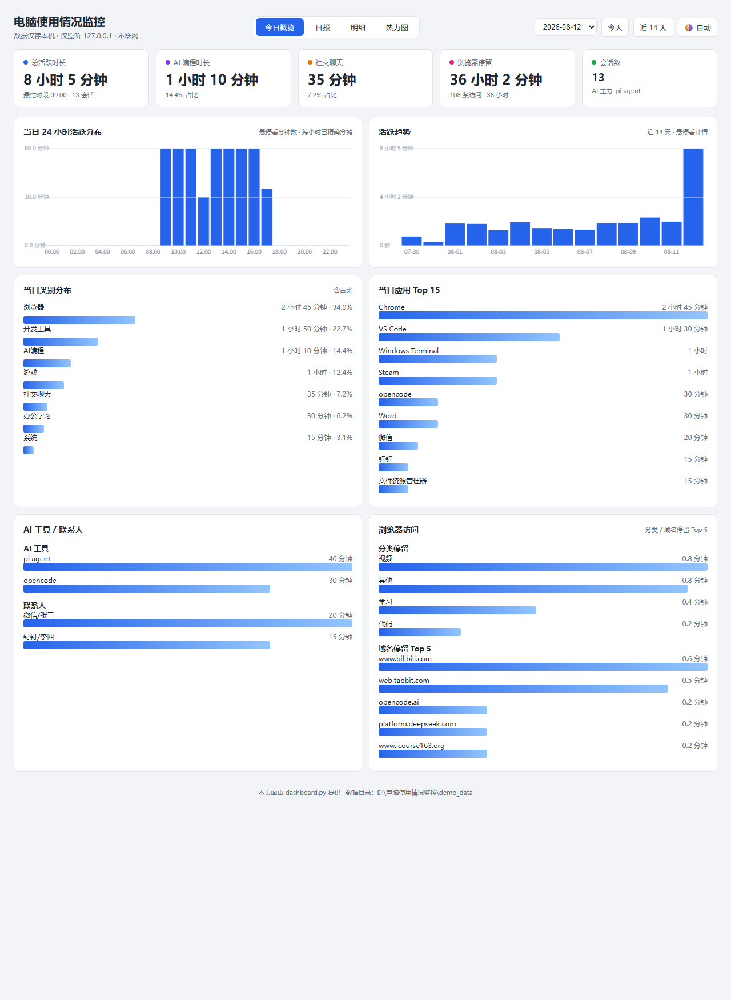
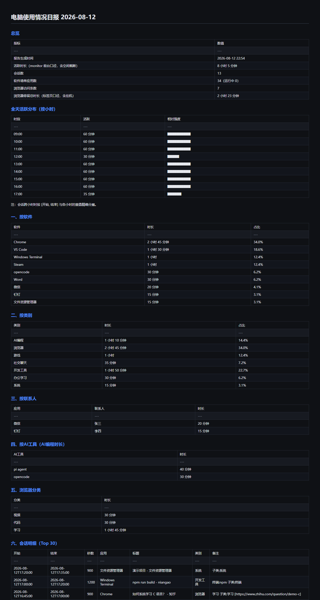

<p align="center">
  
</p>

<h1 align="center">电脑使用情况监控 · UsageMonitor</h1>

<p align="center">
  <b>Windows 本地使用情况监控</b> · 纯本地 · 零依赖 · 静默低占用<br>
  Python 3.10+ · Windows 10/11 x64 · MIT License
</p>

<p align="center">
  
  
  
  
</p>

独立的 Windows 后台监控工具：常驻运行、性能占用极低，自动记录你每天在电脑上
使用了哪些软件、各用了多久；微信/QQ/钉钉跟谁聊了多久；浏览器看了多久视频 / 写了多久代码 / 学了多久习；
以及在 opencode、pi agent、ChatGPT 等 AI 编程工具上花了多少时间。

**纯本地存储，不上传任何云端；不截屏、不录屏、不读聊天内容、不记录键盘输入。**

对应需求文档：《项目需求与开发文档.md》（v1.0），已实现 **Phase 1 + Phase 2 + Phase 3 大部分**。

## 截图

| 网页仪表盘 | 每日汇总日报 |
|---|---|
|  |  |

> 截图使用 `python make_demo_data.py` 生成的**虚构演示数据**，不含任何真实使用记录。

## 目录

- [功能特性](#功能特性)
- [架构](#架构)
- [快速开始](#快速开始需要-python-31064-位-windows-1011)
- [打包为 exe（免 Python 运行）](#打包为-exe免-python-运行)
- [安装与自启](#安装与自启)
- [配置文件说明](#配置文件说明)
- [数据说明](#数据说明)
- [隐私与仓库说明（GitHub）](#隐私与仓库说明github)
- [性能实测](#性能实测本机基准)
- [测试](#测试)
- [FAQ](#faq)
- [已知局限](#已知局限)
- [路线图](#路线图)

## 架构

```
┌────────────┐   每 5 秒轮询   ┌──────────────┐   状态变化才写   ┌──────────────────┐
│ 守护进程     │ ─────────────► │ Win32 采集     │ ──────────────► │ 每日数据           │
│ monitor.py │                │ win32core.py  │                  │ YYYY-MM-DD/       │
│ (exe/托盘)  │                │ 前台窗口/进程树  │                  │ usage.jsonl       │
└────────────┘                │ 空闲检测/窗口状态 │                  │ software_*.json   │
        │                     └──────────────┘                  └────────┬─────────┘
        │ 分类/联系人/AI/子分类                                                │
        ▼                     ┌──────────────┐   ┌──────────────┐            ▼
┌────────────┐   ┌──────────► │ 分类引擎      │   │ 浏览器历史解析  │   ┌──────────────┐
│ 启动/跨天    │   │           │ classifier.py│   │ browser_     │   │ 日报/周报/月报  │
│ 清单刷新     │──┘           └──────────────┘   │ history.py   │──►│ report.py     │
└────────────┘                                  └──────────────┘   │ report.md/csv │
        ▲                                                            └──────┬───────┘
        │ 开机自启（计划任务）                                                ▼
┌────────────┐                                                  ┌──────────────┐
│ install.ps1│                                                  │ 网页仪表盘     │
│ 每晚 19:30 │                                                  │ dashboard.py │
│ 报告任务    │                                                  │ 127.0.0.1    │
└────────────┘                                                  └──────────────┘
```

## 功能特性

- **前台应用计时**：每 5 秒轮询一次前台窗口，仅在状态变化时写一条（静止零写入，CPU 占用 ≈ 0%）
- **空闲/锁屏不计时**：默认 3 分钟无键鼠输入即截断会话
- **软件清单自动扫描**：注册表卸载项 + 开始菜单快捷方式 + 运行中进程，自动分类；
  守护进程启动与跨天时自动刷新当日清单（含新软件补录），全链路约 25ms
- **社交联系人识别**：微信/QQ/钉钉聊天窗口标题 → 联系人/群名，支持别名表 `aliases.json`
- **浏览器活动分类**：标题关键词 → 视频 / 代码 / 学习 / 其他（优先级 学习 > 代码 > 视频）
- **浏览器 URL 级历史解析**：读取 Chromium 系（Chrome/Edge/Tabbit 等）History SQLite，
  日报追加「浏览器访问明细」（URL/域名/时间/分类/停留时长），锁安全复制、只读不干扰浏览器
- **跨天隔离**：所有数据严格按天隔离——monitor 会话在 0 点截断分属两天；
  浏览器停留时长按日界分摊，绝不串天
- **vibe coding（AI 编程）监控**：进程树识别终端里运行的 opencode / pi agent / claude 等
  （含防误伤：不会把 python/pip 因名字含 "pi" 而误判）；**编辑器集成终端同样识别**
  （VS Code / JetBrains 等内置终端里跑 AI CLI 工具也算 AI 编程）
- **自动日报/周报/月报**：每天自动生成 Markdown 日报；支持周报（`--week`）与月报（`--month`）
- **数据导出**：`--json` 结构化导出；每日 `report.csv` 汇总
- **本地网页仪表盘**：24 小时活跃分布、14/30 天趋势、URL 明细、类别/应用/AI 工具统计、会话过滤，仅监听 127.0.0.1
- **托盘图标（可选）**：今日概览 / 打开今日日报 / 暂停·继续 / 退出
- **开机自启**：install.ps1 注册计划任务（崩溃自动重启）；数据默认保留 90 天自动清理

## 快速开始（需要 Python 3.10+，64 位 Windows 10/11）

```powershell
# 克隆并进入项目目录（数据默认保存在项目目录内，可随时迁移）
git clone https://github.com/<你的用户名>/<仓库名>.git
cd <仓库名>

# 首次使用：复制别名模板（可选，联系人显示友好名）
copy aliases.example.json aliases.json

# 测试运行 30 秒（观察是否正常写当日文件夹）
python monitor.py --test 30

# 前台模式运行（日志打印到控制台）
python monitor.py --foreground

# 立即生成今日软件清单
python inventory.py --once
```

> **数据存放位置**：`config.json` 的 `data_root` 为空时，所有数据（日期文件夹/日志/报表）
> 保存在项目脚本所在目录；如需存到别处，把 `data_root` 改成绝对路径即可。

## 桌面应用（Electron 壳）

electron-app/ 提供独立桌面壳：用 Electron 窗口展示本地仪表盘，**不再弹默认浏览器**（数据引擎仍是 Python）。

- **工作原理**：壳启动时探测 127.0.0.1:8765 是否已有仪表盘服务 → 没有则由壳自动启动
  dashboard.py（py/pythonw 自动探测）→ 独立窗口加载页面 → 窗口关闭时若服务是本壳
  启动的则一并退出（托盘常驻的服务则复用保留）。
- **运行（开发模式）**：
  `powershell
  cd electron-app
  npm install          # 首次（含 Electron 运行时）
  npm start            # 打开应用窗口
  npm run smoke        # 冒烟：启动→截图→自动退出
  `
- **打包便携版**：
pm run dist（electron-builder，产物 electron-app/dist/UsageMonitor-Desktop-*.exe，
  免 Node 环境；仍需系统 Python 提供数据服务）。
- **打开方式**：托盘菜单「打开仪表盘」与 monitor.open_dashboard 会**优先**启动 Electron 壳，
  找不到壳时回退默认浏览器（USAGEMON_USE_BROWSER=1 可强制回退）。

## 打包为 exe（免 Python 运行）

```powershell
pip install pyinstaller
python -m PyInstaller UsageMonitor.spec --noconfirm
# 产物：dist\UsageMonitor.exe（约 10 MB 单文件，内置图标与托盘图标资源）
```

> `UsageMonitor.spec` 已配置 exe 图标（`assets/icon.ico`）与内置资源（`assets/tray.ico`）；
> GitHub Actions 会在打 tag 时自动构建并发布 exe（见 `.github/workflows/build.yml`）。

单个 exe 内置全部三个子工具，按首个参数自动分派：

| 命令 | 作用 |
|---|---|
| `UsageMonitor.exe`（双击/无参） | 守护进程 + 托盘图标（桌面不可用时自动降级静默守护） |
| `UsageMonitor.exe --today` / `--day 2026-08-08` / `--week` / `--month 2026-08` | 日报/周报/月报（同 report.py，可加 `--write`/`--json`/`--full`） |
| `UsageMonitor.exe --dashboard --open` | 启动本地仪表盘并打开浏览器 |
| `UsageMonitor.exe --test 30` | 测试模式（无控制台输出，看当日数据文件验证） |

托盘右键菜单：**今日概览 / 打开仪表盘 / 暂停·继续 / 退出**（今日概览与打开仪表盘均打开本地仪表盘，前者定位到概览视图；日报功能已并入仪表盘「日报」视图）。
`install.ps1` 自动优先注册 exe（存在 dist\UsageMonitor.exe 时），否则回退 pythonw + 脚本。

**单实例保护**：守护模式通过 Windows 命名互斥锁（`UsageMonitorMutex`）保证同一时间只有一个监控实例
（防止误开多个导致 usage.jsonl 重复写入）；重复启动的实例会直接退出并在当日 errors.log 留一条记录。

### 查看报告

```powershell
python report.py --today                      # 今天（与当日 report.md 同内容）
python report.py --day 2026-08-08             # 指定日期
python report.py --day 2026-08-08 --write     # 重新生成该日 report.md/csv（含浏览器+清单）
python report.py --day 2026-08-08 --full      # 浏览器 URL 明细不截断（默认前 100 条）
python report.py --day 2026-08-08 --reclassify # 改分类规则后，按当前配置重归类历史记录（自动备份 .bak）
python report.py --week                       # 最近 7 天
python report.py --month 2026-08              # 月度汇总
python report.py --today --json               # 结构化 JSON 导出
```

### 浏览器历史明细

```powershell
python browser_history.py --today             # 今日 URL 级明细（自动发现 Chrome/Edge/Tabbit 等）
python browser_history.py --day 2026-08-08
python browser_history.py --list-browsers     # 查看发现了哪些历史库
```

### 网页仪表盘

```powershell
python dashboard.py --open                    # 浏览器打开 http://127.0.0.1:8765
python dashboard.py --port 9000               # 自定义端口
UsageMonitor.exe --dashboard --open           # exe 方式
```

仪表盘功能（v3）：
- **自动明暗主题**：默认跟随系统（prefers-color-scheme，Windows 切换深浅色时实时跟随）；
  右上角 🌗 按钮可循环切换 自动/浅色/深色（localStorage 记住选择）；canvas 图表颜色同步适配
- 四个视图 Tab：**今日概览 / 日报 / 明细 / 热力图**
- 今日概览：大数字卡片（总活跃/AI/社交/浏览器/会话数）+ 24 小时活跃分布 + 14/30 天趋势 + 类别/应用/AI 工具/联系人/浏览器汇总
- **日报视图**：选日期渲染当日 report.md（前端 mini-markdown，表格/标题/列表/代码块）
- **明细视图**：会话明细与浏览器 URL 明细（均支持关键词过滤）
- **热力图视图**（GitHub Contribution Graph 风格）：
  - 每日活跃热力图：最近 12 周，行=周一~周日，列=周，颜色 5 档=当天总活跃（悬停看日期/星期/时长）
  - 小时级热力图：最近 14/30 天，X=日期 Y=0-23 小时，颜色=该小时活跃分钟数
  - 统计卡：活跃天数 / 最长连续活跃 / 日均活跃 / 近 7 天总时长

## 安装与自启

```powershell
# 以 PowerShell 运行（如注册失败，请用管理员权限）
powershell -ExecutionPolicy Bypass -File install.ps1

# 卸载（可附带删除全部记录数据）
powershell -ExecutionPolicy Bypass -File uninstall.ps1
```

install.ps1 注册两个计划任务：

| 任务名 | 触发时机 | 作用 |
|---|---|---|
| `UsageMonitor` | 登录时 | `pythonw.exe` 静默启动 `monitor.py --tray`（含托盘；托盘不可用时自动降级静默守护），崩溃自动重启 |
| `UsageMonitorReport` | 每天 19:30 | 重新生成当天 report.md/csv（含浏览器历史与软件清单快照） |

## 目录结构

```
<项目目录>\
├─ monitor.py              # 守护进程（轮询前台窗口、写日志、跨天聚合）
├─ win32core.py            # Win32 API 封装（ctypes，零第三方依赖）
├─ classifier.py           # 分类引擎（类别/联系人/AI 工具/黑名单/子分类）
├─ inventory.py            # 软件清单扫描
├─ report.py               # 日报/周报/月报生成与 CLI 查询（支持 --json 导出）
├─ browser_history.py      # 浏览器 URL 级历史解析（Chromium 系）
├─ dashboard.py            # 本地网页仪表盘（仅 127.0.0.1）
├─ tray.py                 # 托盘图标（可选）
├─ test_all.py             # 完整集成测试（无头确定性）
├─ install.ps1 / uninstall.ps1   # 安装 / 卸载（计划任务注册）
├─ config.json             # 配置（分类/阈值/黑名单；data_root 为空=脚本目录）
├─ aliases.example.json    # 联系人别名模板（真实 aliases.json 不入库）
├─ make_demo_data.py       # 生成虚构演示数据（截图/试用，可复现）
├─ assets/                 # 图标资产（icon.ico/png 3D 图标 + tray.ico 扁平托盘图标）
├─ docs/screenshots/       # 项目截图（仪表盘/日报，演示数据）
├─ UsageMonitor.spec       # PyInstaller 打包配置（复现 exe 构建）
├─ LICENSE                 # MIT
├─ .gitignore              # 排除运行数据/构建产物/本地配置
├─ README.md               # 本文件
├─ 项目需求与开发文档.md    # 需求文档 v1.0
└─ YYYY-MM-DD\             # 运行期自动生成（每天一个，不入库）
   ├─ usage.jsonl          # 原始会话日志（JSON Lines，追加写）
   ├─ software_inventory.json / .csv   # 当日软件清单快照
   ├─ report.md            # 自动日报
   ├─ report.csv           # 汇总表
   └─ errors.log           # 运行错误日志（可选）
```

月度汇总输出在 `<data_root>\YYYY-MM\` 下（`report_month.md` / `report_month.json`）。

## 配置文件

### config.json（修改后重启 monitor 生效）

| 配置项 | 说明 |
|---|---|
| `poll_interval_s` | 轮询间隔（秒），默认 5 |
| `idle_threshold_s` | 空闲判定阈值（秒），默认 180 |
| `retention_days` | 数据保留天数，默认 90 |
| `data_root` | 数据根目录 |
| `apps` | exe → 显示名映射 |
| `categories` | 类别规则（13 类）：`exe` 关键词 / `title` 关键词，按顺序匹配 |
| `social_apps` / `social_main_titles` | 社交软件识别与主界面标题 |
| `browser_exes` | 浏览器进程列表 |
| `terminal_exes` | 终端进程列表（做进程树 AI 工具识别） |
| `editor_exes` | 编辑器进程列表（VS Code/JetBrains 等内置终端同样做进程树 AI 识别） |
| `ai_keywords` / `ai_tool_names` | AI 工具关键词与规范化名称 |
| `browser_categories` / `browser_category_priority` | 浏览器站点分类规则（视频/代码/学习/购物/新闻）与优先级 |
| `terminal_tools` | 终端 TUI 工具识别（窗口标题关键词 → term_tool 字段） |
| `subcategories` | 二级子分类规则（大类 → exe 关键词 → 子类字段） |
| `browser_history_enabled` / `browser_history` | URL 级历史解析开关与各浏览器 user_data 路径（null=自动探测） |
| `title_blacklist` | 标题隐私黑名单（正则），命中记 `[已隐藏]`（历史解析的 URL/标题同样生效） |

### aliases.json（联系人别名）

```json
{ "aaa123": "张三", "工作群(12)": "部门工作群" }
```

## 数据说明

### 数据位置（可移植）

- `data_root` 语义：**空字符串 = 程序所在目录**（脚本目录；打包 exe 时为 exe 所在目录，
  不会写进临时解压目录）。改成绝对路径可把数据放到任何位置。
- 全项目零硬编码路径（`paths.py` 统一解析），拷到任意盘符/机器直接运行。

### 配置文件：单一事实源

- `config.default.json`：内置默认规则（分类/关键词/黑名单等，随仓库维护）。
- `config.json`：用户覆盖（不存在时自动使用默认规则）。
- 新增软件/分类只需改 `config.default.json`（或直接覆盖 `config.json`）；
  `python classifier.py --sync-config` 可对比两侧，发现"默认规则更新但 config.json 没跟上"的遗漏。

### 数据校验与修复

- `usage.jsonl` 写入带 `flush + fsync`（防断电半行）。
- `python report.py --verify`：扫描所有日期目录，报告坏行。
- `python report.py --verify --repair`：剔除坏行（自动备份 `.bak_verify`）并重建缺失日报。

`usage.jsonl` 每行一个 JSON 会话记录：

```json
{
  "start": "2026-08-08T10:00:00",
  "end": "2026-08-08T10:05:00",
  "duration_ms": 300000,
  "exe": "wechat.exe",
  "app": "微信",
  "title": "张三",
  "category": "社交聊天",
  "contact": "张三",
  "ai_tool": null,
  "active": true
}
```

| 字段 | 类型 | 说明 |
|---|---|---|
| start / end | string | 会话起止（本地时间，ISO 8601） |
| duration_ms | int | 时长（毫秒） |
| exe / app | string | 进程文件名（小写）/ 显示名 |
| title | string | 窗口标题（黑名单命中为 `[已隐藏]`） |
| category | string | AI编程 / 浏览器 / 影音娱乐 / 社交聊天 / 开发工具 / 办公学习 / 系统 / 其他 |
| contact | string/null | 社交联系人/群名 |
| ai_tool | string/null | AI 工具名（opencode / pi agent / chatgpt …） |
| active | bool | 是否活跃计时段 |
| browser_category | string（可选） | 浏览器站点分类（视频/代码/学习/其他） |
| subcategory | string（可选） | 二级子分类（影音娱乐→视频播放/音乐，游戏→平台/单机/电竞网游，开发工具→编辑器/终端/容器…） |
| term_tool | string（可选） | 终端 TUI 工具（vim/git/lazygit/htop/npm…，按窗口标题识别，路径防误伤） |
| window_state | string（可选） | 窗口状态：normal / maximized / fullscreen |
| url | string（可选） | 浏览器会话关联的访问 URL（会话↔历史时间重叠匹配，命中黑名单为 `[已隐藏]`） |

## 隐私与仓库说明（GitHub）

- **运行数据绝不进仓库**：每天的日期文件夹（usage.jsonl / report.md / 软件清单 / 浏览器访问明细）
  包含真实窗口标题与 URL，属于个人隐私数据——`.gitignore` 已排除 `20*-*-*/`、`usage.db` 等；
  `git status` 永远看不到它们
- **本地私有配置不入库**：`aliases.json`（真实联系人别名）被忽略，仓库提供 `aliases.example.json` 模板
- 代码本身不包含任何个人数据；分类规则、关键词、黑名单全部在 `config.json`（可入库的通用规则）
- 默认无任何联网上传；仪表盘仅监听 127.0.0.1；截屏/录屏/OCR/键盘钩子/剪贴板读取均未实现
- 数据默认保留 90 天自动清理（`config.json` 可调）

## 隐私与安全（运行时）

- 所有数据仅保存在本机 `data_root`，**无任何联网上传**
- 只记录元数据（应用名、窗口标题、时间、类别）；不读取聊天消息、密码、输入内容、文件内容
- `title_blacklist` 命中的标题一律记为 `[已隐藏]`，不落盘原文
- **仪表盘防偷读（CSRF 防护）**：所有 `/api/*` 校验 `Origin`/`Referer`，必须指向
  `127.0.0.1:<port>` 或 `localhost:<port>`，否则返回 403——恶意网页的 JS 无法读取你的监控数据；
  页面同时带 `X-Frame-Options: DENY` 与 CSP（防点击劫持/外部资源注入）
- 浏览器 URL 级解析仅读取本机 History SQLite（复制到临时目录以只读方式解析，不修改浏览器数据）；
  命中黑名单的 URL/标题同样掩蔽为 `[已隐藏]`；不需要时可在 config.json 设 `browser_history_enabled: false`
- 浏览器"停留时长"是**标签页前台计时**口径（含空闲/挂机时间、多标签可叠加），会高于真实活跃时长；
  真实活跃时长以 monitor 会话统计（含空闲截断）为准；两者在日报中并列展示
- 明确不实现（除非你主动开启）：截屏、录屏、OCR、键盘钩子、剪贴板读取

## 性能实测（本机基准）

| 指标 | 实测 | 文档目标 |
|---|---|---|
| 单次轮询开销 | 20 μs（3 个 Win32 调用 + 缓存） | 微秒级 |
| 静态 CPU（60s 守护） | 0.078% | < 0.1% |
| 内存（Python 守护） | ~23 MB 工作集 | ≤ 30 MB |
| 守护启动 | ~86 ms（含昨日补报 + 清单刷新） | - |
| 日报生成（跨天 0 点） | ~21 ms | - |
| 浏览器历史解析（一天） | ~17 ms（复制 5.8MB 库仅 2.9ms） | - |
| 软件清单全链路扫描 | ~25-45 ms | - |
| 磁盘占用 | ~92 KB/天 | ≤ 5 MB/天 |

## 测试

```powershell
python monitor.py --test 30   # 测试模式（跑 N 秒后退出并打印汇总）
python test_all.py            # 完整集成测试（109 项断言，约 1 分钟）
```

test_all.py 通过猴子补丁模拟前台窗口/空闲/进程树，覆盖：切换计时、空闲不计时、微信联系人、
浏览器分类、终端 AI 工具、AI 误伤防护、跨天轮转、跨天隔离、隐私黑名单、暂停/继续、
保留清理、报表管线、清单扫描、浏览器历史、别名表、重归类。

**验收要点**：切换 3 个软件各 1 分钟 → 日报给出各自时长；锁屏 10 分钟 → 不计时；
重启后计划任务自动拉起；静态 CPU 占用 < 0.1%。

## FAQ

**Q: 数据存在哪里？会不会上传？**
A: 存在 `data_root`（config.json 为空时=项目脚本目录）下的日期文件夹；**纯本地，无任何联网上传**。

**Q: 为什么日报里"浏览器停留时长"比"活跃时长"大很多？**
A: 两个口径不同：浏览器停留时长是**标签页前台计时**（页面开着就算，含挂机/多标签叠加，可能超过 24 小时）；
活跃时长是 monitor 按**键鼠输入**统计（3 分钟无输入即截断）。真实人工使用时长以活跃时长为准。

**Q: 修改了 config.json 的分类规则，历史数据还是旧的？**
A: 用 `python report.py --day YYYY-MM-DD --reclassify` 按新规则重归类历史记录（自动备份 `.bak`）。

**Q: 管理员权限运行的窗口标题读不到？**
A: 普通权限无法读取提权窗口标题（Windows 安全限制）；需完整数据请以管理员模式运行监控。

**Q: 托盘没有图标 / exe 没反应？**
A: 守护进程会降级为静默运行（托盘不可用时），数据记录不受影响；检查 `errors.log` 看托盘初始化错误。

**Q: 支持 Firefox 吗？**
A: 浏览器 URL 级解析目前支持 Chromium 系（Chrome/Edge/Tabbit 等，自动探测）；
Firefox 用 places.sqlite 结构不同，暂不支持；其他浏览器可在 config 的 `browser_history` 配 user_data 路径。

**Q: 杀毒软件误报？**
A: 打包的 exe 建议代码签名；可将 `data_root` 目录加入杀软白名单。

**Q: 数据保留多久？**
A: 默认 90 天（`config.json` 的 `retention_days`），超期日期文件夹自动清理。

## 已知局限

- **管理员权限运行的窗口标题可能读不到**（普通权限无法读取）；如需完整标题，请以管理员身份运行
- **UWP/商店应用标题可能为空**：按 exe 记录，不做深度分类
- **后台标签页不计时**：本方案是「前台注意力」口径，后台放视频不记入浏览器时长
- **URL 级历史解析仅覆盖 Chromium 系浏览器**（Chrome/Edge/Tabbit 等自动探测）；
  Firefox 使用 places.sqlite 结构不同，暂不支持；其他浏览器可在 `browser_history` 配置 user_data 路径
- **pi agent 等工具的进程名**需按实际安装确认后补充到 `ai_keywords`（防误伤 python/pip 已在代码中防护）
- **杀软误报**：打包 exe 建议代码签名；可将 `data_root`（数据目录）加入杀软白名单

## 技术要点

- 纯 Python 标准库 + `ctypes` 直调 Win32（`GetForegroundWindow` / `GetWindowTextW` / `GetLastInputInfo` /
  `CreateToolhelp32Snapshot`），**零第三方依赖**（不依赖 psutil / pywin32）
- 进程树遍历用 `CreateToolhelp32Snapshot` 而非 WMI 轮询（性能差）
- 会话记录 JSON Lines 追加写，静止零写入；数据保留 90 天自动清理
