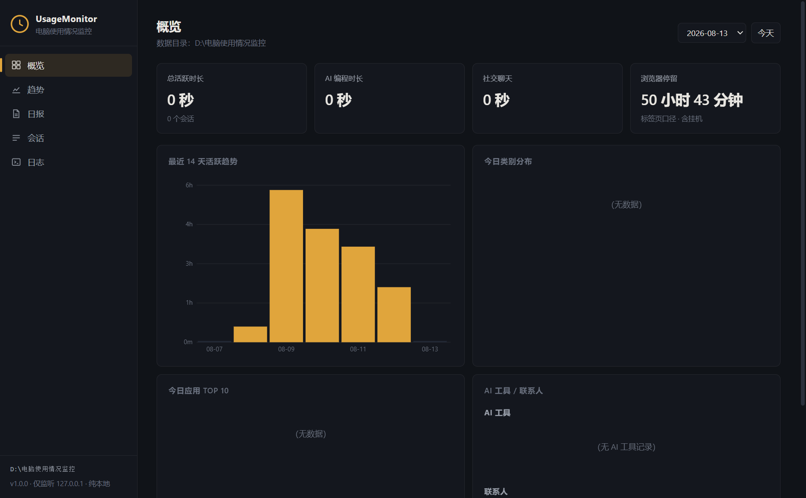

# UsageMonitor · 电脑使用情况监控

> 纯 vibe coding 产物 · 本地优先 · Python 标准库 + ctypes · 零第三方运行时依赖

[UsageMonitor](https://github.com/Niangaol/UsageMonitor) 是一个 Windows 本地使用情况监控工具。它以常驻守护进程方式运行，采集前台窗口信息，记录软件、社交联系人、浏览器与 AI 编程使用时长，并由此生成日报、周报、月报和本地网页仪表盘。

No build step，无框架，无打包器 —— 纯 Python 标准库 + vanilla JS，`ctypes` 直调 Win32。数据默认只存在本机，不截屏、不录屏、不读键盘输入、不读聊天内容。

| 网页仪表盘 | 每日日报 | 桌面壳 |
|---|---|---|
|  |  |  |

---

## Contents

- [Why UsageMonitor](#why-usagemonitor) — 它是什么，和其他工具怎么比
- [Quick start](#quick-start) — clone + `python monitor.py`
- [Features](#features) — 监控 / 报表 / 洞察 / 适配 / 更新 / 安全
- [Configuration & access](#configuration--access) — 配置发现、环境变量、访问方式
- [Architecture](#architecture) — 后端模块布局
- [Running tests](#running-tests)
- [Docs](#docs)

---

## Why UsageMonitor

多数使用统计工具把数据同步到云端，或依赖商业服务计费，且没有专门覆盖“AI 编程”和“浏览器 URL 级历史”两个维度。

UsageMonitor 的定位：纯本地的、可审计的、零第三方依赖的监控工具，把“用了多久”和“在 AI 上真正写了多少”一起记录。

> **独特定位：为“AI 编程”打造的电脑使用时间追踪工具。**
>
> 在大部分同类开源项目里，“AI 编程”要么只是编辑器/插件维度的一小部分，要么只统计 Token 消耗或会话数。UsageMonitor 把 **AI 编程时间作为核心维度**，与软件、社交联系人、浏览器等并列，整合进整套电脑使用情况分析——既有前台窗口 / 进程树层面的 AI 工具计时，也有可选的本机 AI 会话深度统计。

与其他工具的关键差异：

- **纯本地默认无上传** — 数据在 `data_root`，仪表盘只监听 127.0.0.1
- **零第三方运行时依赖** — 不依赖 psutil / pywin32 / 浏览器扩展 / 云服务
- **AI 编程监控** — 进程树识别终端里的 opencode / pi agent / claude 等，而非只看前台窗口
- **浏览器 URL 级历史** — Chromium + Firefox 访问明细，分类与停留时长
- **可选 AI 会话深度统计** — 读取本地 AI 工具会话文件，统计轮数与生成量
- **开源免费（MIT）**

**vs. 同类工具**：

| | UsageMonitor | RescueTime | ManicTime | WakaTime | ActivityWatch |
|---|---|---|---|---|---|
| 本地优先、默认不上传 | Yes | 云同步 | 部分 | 云同步 | Yes |
| 开源免费 | Yes (MIT) | No | No | 部分 | Yes (MPL) |
| 零第三方运行时依赖 | Yes | No | No | No | 部分 |
| AI 编程监控（进程树） | Yes | No | 部分 | 部分 | 部分 |
| 浏览器 URL 级历史 | Yes | 部分 | 部分 | 编辑器为主 | 部分 |
| 本地网页仪表盘 | Yes | No | No | No | Dashboard |
| 应用内更新 | Yes | — | — | — | — |

> 说明：同类工具的能力边界会随版本变化，表内为常规功能口径。

---

## Quick start

```powershell
git clone https://github.com/Niangaol/UsageMonitor.git
cd UsageMonitor

# 测试运行 30 秒（观察是否正常写当日文件夹）
python monitor.py --test 30

# 前台运行
python monitor.py --foreground

# 托盘守护
python monitor.py --tray
```

图形安装 / 卸载（免命令行）：

```powershell
powershell -ExecutionPolicy Bypass -File installer.ps1
powershell -ExecutionPolicy Bypass -File uninstaller.ps1
```

如果你需要读取管理员权限窗口的标题：

```powershell
python monitor.py --admin   # 非管理员时自动弹 UAC 提权重启
```

> **停止守护**：托盘右键「退出」；`--foreground` 按 Ctrl-C；以计划任务运行时由任务管理器处理。

---

## Features

### Monitoring

- 前台窗口计时：默认 5 秒轮询，仅在状态变化时写一条（静止零写入）
- 空闲/锁屏不计时：默认 3 分钟无键鼠输入截断会话
- 软件清单扫描：注册表卸载项、开始菜单快捷方式、运行中进程
- 社交联系人识别：微信 / QQ / 钉钉 / 企业微信 / 飞书 / Slack / Teams 等
- 浏览器活动分类：标题关键词 → 视频 / 代码 / 学习 / 其他
- 浏览器 URL 级历史：Chromium（Chrome/Edge/Brave/Opera/Vivaldi 等）与 Firefox
- AI 编程监控：进程树识别终端/编辑器集成终端里的 AI CLI 工具

### Reports & dashboard

- 日报、周报、月报（Markdown + CSV）
- 本地网页仪表盘，十个视图：概览 / 趋势 / 日报 / 周报 / 月报 / 会话 / 日志 / 分组 / 洞察 / 设置
- 数据导出（CSV / JSON）、备份 / 恢复

### Insights & AI

- 离线规则引擎：学习 / 游戏 / 健康 / 效率 / 平衡 / 趋势建议
- 可选 AI 洞察：OpenAI 兼容端点，聚合统计隐私过滤，默认关闭
- AI 会话深度统计：读取 opencode / ChatGPT / Claude / Cursor / Windsurf / Trae / DeepSeek / Pi Agent / DSH 本地会话文件

### Adaptation

- 应用分组自定义：覆盖层配置，实时生效
- 常用软件显示名 / 分类：Obsidian / Notion / Slack / Teams / Steam / Spotify / VLC / PowerToys 等
- 浏览器适配：Vivaldi / Yandex / Chromium / Opera GX / Arc / Cent / 搜狗 / 傲游 / Slimjet 等
- AI 工具识别：Codex / Goose / Amazon Q / DSH / Claude Code / Gemini CLI / Continue / Bamboo / Augment / Warp 等
- 终端 TUI 工具：tmux / btop / lazygit / k9s / lazydocker / kubectl / fzf / rg / ncdu / tig 等

### Updates & packaging

- 新版本检测：启动检查、托盘菜单、仪表盘设置页
- 应用内更新：SHA256 校验下载 → 优雅退出 → 替换 exe → 自动重启
- 更新供应链安全：下载地址白名单，仅接受 GitHub 官方域名或 `update.api_base` 指定域名
- PyInstaller 单文件 exe，CI 打 tag 自动构建 Release（附 `sha256`）

### Security & privacy

- 仪表盘只监听 `127.0.0.1`；所有 `/api/*` 校验 Origin / Referer
- 可选访问口令（`dashboard_token`，HMAC 常量时间比较）
- 标题隐私黑名单，命中记 `[已隐藏]`
- AI 洞察默认关闭，开启才发送聚合统计（不含标题 / URL / 联系人）
- UWP/商店应用识别（`uwp_app_names`）

### Optional backends

- SQLite 后端 `usage.db`：JSONL 之外的镜像/索引，支持回填 / 重建 / 一致性校验
- GitHub Pages 文档站：https://niangaol.github.io/UsageMonitor/

---

## Configuration & access

### 配置发现

| 项 | 怎么找到 |
|---|---|
| 配置文件 | `config.json`（不存在时用 `config.default.json`） |
| 数据根目录 | `data_root`；空字符串 = 程序所在目录 |
| 配置热重载 | monitor 每轮重读 `config.json`（`data_root` 保持启动值） |
| 别名表 | `<data_root>/aliases.json`（不入库） |

### 环境变量

| 变量 | 默认 | 说明 |
|---|---|---|
| `USAGEMON_PROJECT_DIR` | 脚本目录 | 项目根覆盖 |
| `DATA_ROOT` | `config.json` 的 `data_root` | 数据根覆盖 |
| `PORT` | `8765` | 仪表盘端口 |
| `PYTHON` | 自动探测 | Electron 壳 / 启动器使用的 Python |
| `USAGEMON_USE_BROWSER` | 未设置 | `=1` 强制用浏览器打开仪表盘（默认优先 Electron 壳） |

### 访问

```powershell
python dashboard.py --open            # 打开 http://127.0.0.1:8765
python dashboard.py --port 9000       # 自定义端口
UsageMonitor.exe --dashboard --open   # exe 方式
```

托盘右键：今日概览 / 打开仪表盘 / 检查更新 / 暂停·继续 / 退出。

---

## Architecture

No build step、无框架 —— Python 标准库 `http.server` + vanilla JS。核心模块：

```
monitor.py         守护进程（轮询前台窗口、托盘、跨天聚合、--admin）
win32core.py       Win32 API（ctypes）：前台窗口 / 进程 / 空闲 / UWP / 管理员检测
classifier.py      分类、联系人、AI 工具、终端工具、配置加载
report.py          日报/周报/月报聚合、重分类、校验修复（含 SQLite 快速路径）
dashboard.py       本地网页仪表盘 + 全部 /api/* 路由
browser_history.py Chromium + Firefox 历史解析（含 Firefox 停留时长估算）
insights.py        智能洞察（离线规则 + 可选 AI）
ai_sessions.py     AI 会话深度统计
sqlite_store.py    可选 SQLite 后端 + 一致性校验
updater.py         新版本检测、应用内更新、下载地址白名单
tray.py            托盘图标
paths.py / applog.py  路径解析 / 滚动日志
```

状态默认存在仓库外的运行目录（日期文件夹 + `usage.jsonl`）。

---

## Running tests

```powershell
python test_all.py   # 268 项断言，无头确定性
ruff check .         # 0 违规
```

CI：测试 → coverage（含 insights/updater/sqlite_store/ai_sessions）→ PyInstaller 构建 → exe 冒烟 → 打 tag 发布 Release。

> Windows 临时目录权限异常时，先清理 `%TEMP%\usagemon_hist_*` / `dsh-*` 再跑测试。

---

## Docs

- [CHANGELOG.md](CHANGELOG.md)（[English](CHANGELOG.en.md)）
- [README.en.md](README.en.md)（English）
- [CONTRIBUTING.md](CONTRIBUTING.md)
- [TODO.md](TODO.md)（交接/待办清单）
- [项目需求与开发文档.md](项目需求与开发文档.md)
- GitHub Pages：https://niangaol.github.io/UsageMonitor/
