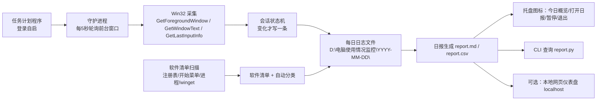

# 电脑使用情况监控工具 —— 需求与开发文档

- 文档版本：v1.0
- 编写日期：2026-08-08
- 项目性质：独立 Windows 系统工具（不依赖 Codex / 不依赖任何 AI 客户端）
- 交付/数据根目录：`D:\电脑使用情况监控\`

---

## 1. 项目概述

开发一个**独立的 Windows 后台监控工具**，常驻运行、性能占用极低，自动记录用户每天在电脑上：
- 使用了哪些软件、分别使用了多久（基础监控）；
- 在微信、QQ、钉钉、浏览器中的具体活动（社交软件深度监控）；
- 在 vibe coding（AI 编程）工具中的使用情况（opencode、pi agent、ChatGPT 桌面版等）。

所有数据**只保存在本机**，不上传任何云端，不做截屏、不读聊天内容。

## 2. 目标用户与使用场景

1. 用户想复盘“我今天用了什么软件，各用了多久”；
2. 用户想知道“我今天在微信里跟谁聊了多久、浏览器里看了多久视频 / 写了多久代码 / 学了多久习”；
3. 用户使用 opencode、pi agent、ChatGPT、Cursor 等 AI 编程工具，想统计“今天 AI 编程用了多久”；
4. 用户希望每天自动生成一份当天的使用日志/报告，放在当天的日期文件夹里，可长期查看。

## 3. 术语定义

| 术语 | 含义 |
|---|---|
| 会话（Session） | 用户持续停留在同一个“应用 + 窗口上下文”的时间段 |
| 前台窗口 | Windows 当前获得焦点的窗口（`GetForegroundWindow`） |
| 空闲（Idle） | 键盘/鼠标超过阈值（默认 3 分钟）无输入的状态 |
| 类别（Category） | 对软件/网页活动的分类：AI编程、社交聊天、浏览器、开发工具等 |
| 联系人（Contact） | 从微信/QQ/钉钉窗口标题解析出的聊天对象 |
| vibe coding | 使用 AI 编程工具（opencode、pi agent、ChatGPT、Cursor 等）进行开发 |

## 4. 运行环境

- Windows 10 / Windows 11（64 位，x64）；
- 单用户登录会话（不需要跨会话）；
- 建议运行时：Python 3.10+（开发期）或编译后的单文件 exe（交付期）；也可使用 C#/.NET；
- 默认**无需管理员权限**（可提供“管理员模式”作为可选增强，见第 15 节）；
- 无网络依赖（离线可用）。

## 5. 总体架构



模块划分：

| 模块 | 职责 |
|---|---|
| monitor（守护进程） | 轮询前台窗口、维护会话、写日志、触发每日聚合 |
| inventory（软件清单） | 扫描已装软件、自动分类、写入当日清单 |
| classifier（分类引擎） | 根据规则把 exe/标题/域名映射到类别 |
| report（报表） | 读取日志，生成日报/周报、CLI 查询 |
| tray（托盘，可选） | 常驻托盘图标与菜单 |
| dashboard（网页，可选） | 本地网页查看 |

## 6. 功能需求

### 6.1 软件清单总览与自动分类

目标：尽可能完整地总览用户电脑上安装/使用过的软件，并自动分类。

**扫描来源（全部或尽力而为）：**

| 来源 | 说明 | 优先级 |
|---|---|---|
| 注册表卸载项 | `HKLM\SOFTWARE\Microsoft\Windows\CurrentVersion\Uninstall`、`HKLM\SOFTWARE\WOW6432Node\...`、`HKCU\SOFTWARE\...`，读取 DisplayName / DisplayIcon | 必做 |
| 开始菜单快捷方式 | `%APPDATA%\Microsoft\Windows\Start Menu\Programs` 与 `C:\ProgramData\Microsoft\Windows\Start Menu\Programs` 下的 `.lnk`（解析目标 exe） | 必做（尽力） |
| 运行中进程 | 扫描时正在运行的进程 exe 名 | 必做 |
| `winget list`（可选） | 补充商店类应用 | 可选 |

**分类体系（初稿，规则可配置）：**

| 类别 | 示例 |
|---|---|
| AI编程 / vibe coding | opencode、pi agent、ChatGPT、Claude、Cursor、Windsurf、Trae、Gemini CLI、Aider、Copilot、Cline |
| 社交聊天 | 微信、QQ、TIM、钉钉、Telegram、Discord |
| 浏览器 | Chrome、Edge、Firefox、360浏览器、QQ浏览器 |
| 开发工具 | VS Code、PyCharm、JetBrains 全家桶、Git、Docker、Windows Terminal、cmd、PowerShell |
| 办公学习 | Word、Excel、PPT、WPS、Notion、Obsidian、OneNote、学习平台 |
| 影音娱乐 | PotPlayer、VLC、Spotify、Steam、WeGame、B站客户端 |
| 系统 | 资源管理器、设置、任务管理器、未识别项 |
| 其他 | 以上未覆盖 |

**分类依据（按优先级匹配）：** exe 文件名关键词 → 软件显示名关键词 → 窗口标题关键词。全部规则放在 `config.json`，用户可编辑。

**输出：** 每次启动守护进程时刷新一次，写入当日文件夹 `software_inventory.json`（和可选的 `software_inventory.csv`）；运行中首次发现的新软件自动补录。

### 6.2 基础使用监控（哪些软件、多久）

**采集方式（Windows 标准 Win32 API）：**

| 调用 | 用途 |
|---|---|
| `GetForegroundWindow()` | 当前前台窗口句柄 |
| `GetWindowThreadProcessId()` | 得到进程 PID → exe 文件名 |
| `GetWindowText()` | 窗口标题 |
| `GetLastInputInfo()` | 最后一次键盘/鼠标输入，用于空闲判断 |
| `CreateToolhelp32Snapshot()` | 枚举进程（PID、父 PID、exe 名），用于 AI 工具进程树识别 |

**轮询策略：**
- 默认每 **5 秒**轮询一次（可配置 1–30 秒）；
- 只有当 `(exe, 窗口标题, AI工具归属)` 发生变化时才写一条会话记录，**静止时零写入**；
- 空闲（默认 3 分钟无输入）不计入活跃时长：会话在空闲开始时截断，输入恢复后新开会话；
- 锁屏/睡眠：轮询期间 `GetLastInputInfo` 自然变为超长空闲，不产生计时；恢复后继续。

**会话记录字段（详见第 9 节）：**
`开始时间、结束时间、时长、exe、显示名、窗口标题、类别、联系人、AI工具、是否活跃`。

### 6.3 社交软件深度监控

#### 6.3.1 微信 / QQ / 钉钉：“跟谁聊了多久”

原理：这三个软件的前台聊天窗口标题就是当前聊天对象（联系人昵称或群名）。

- 微信：`WeChat.exe` / `Weixin.exe`，聊天窗口标题 = 联系人/群名；主界面标题为“微信”；
- QQ：`QQ.exe` / `TIM.exe`，聊天窗口标题 = 好友昵称/群名；
- 钉钉：`DingTalk.exe`，会话窗口标题形如“与 李四 的会话”或群名。

实现要求：
1. 识别应用后，把**窗口标题解析为联系人/群名**；
2. 维护**别名表** `aliases.json`（如 `aaa123 → 张三`），日报显示友好名；
3. 主界面/非聊天窗口（标题为“微信”“QQ”“钉钉”等）不产生联系人记录，只计应用时长；
4. 按 `(应用, 联系人)` 聚合当日聊天时长；
5. **明确禁止**：不读取聊天消息内容、不读取聊天数据库（除非用户明确选择高级模式，见 15.4）。

#### 6.3.2 浏览器：“看视频 / 写代码 / 学习”

原理：浏览器（Chrome/Edge/Firefox）窗口标题 = 当前活动标签页标题，包含站点/网页关键词。

- 按**标题/域名关键词规则**分类为：`视频 / 代码 / 学习 / 其他`；
- 规则示例（放 `config.json`，可编辑）：
  - 视频：bilibili、youtube、youku、iqiyi、腾讯视频、爱奇艺、优酷、芒果、抖音、快手；
  - 代码：github、stackoverflow、leetcode、codesandbox、replit、vscode.dev、gitlab；
  - 学习：mooc、coursera、学堂在线、zhihu、知乎、csdn、w3school、mdn、docs、教程、学习、course。
- 优先级：`学习 > 代码 > 视频`，或由配置决定，避免“B站看教程”被误判为纯视频；
- 每个浏览器会话记录同时带上 `category` 字段，日报按类别汇总。

**可选增强（不在 v1 范围）**：解析浏览器 History SQLite 得到 URL 级明细；需解决浏览器运行时文件锁问题，列为 Phase 3。

### 6.4 vibe coding（AI 编程）监控

用户明确使用：**opencode、pi agent、ChatGPT（桌面版）**，以及可能使用的 Cursor、Windsurf、Trae、Claude 等。

#### 6.4.1 自有窗口的 AI 工具
ChatGPT 桌面版、Cursor、Windsurf、Trae 等有独立窗口，按“进程 exe + 窗口标题”直接归属到对应工具。

#### 6.4.2 终端里的 CLI 工具（重点难点）
opencode、pi agent、claude、aider、gemini 等运行在终端里，前台窗口属于 Windows Terminal / cmd / PowerShell，**不能只看前台进程**。

解决方案：**进程树识别**
1. 每次轮询枚举全量进程表（`CreateToolhelp32Snapshot`），得到 `pid → (exe, parent_pid)`；
2. 取前台窗口进程 pid，向下 BFS 遍历所有子孙进程；
3. 若子孙进程中存在匹配 AI 工具关键词的 exe（如 `opencode.exe`、`pi-agent.exe`、`claude.exe`），则该时间段归属到对应 AI 工具；
4. 结合终端窗口标题（部分 TUI 会改写标题）做第二重校验；
5. 记录字段 `ai_tool` 写明具体工具名（如 `opencode`），日报按 AI 工具汇总“AI 编程时长”。

关键词匹配必须**避免误伤**（例如不能把 `python.exe`、`pip.exe` 因包含 “pi” 而误判为 pi agent，见 16.1）。

#### 6.4.3 可选增强（Phase 3，需用户确认）
读取 opencode / ChatGPT 等工具的**本地会话记录文件**（JSON/文本），统计“今天 AI 交互轮数、生成行数”等指标。默认不做。

### 6.5 数据存储与每日目录结构（硬性要求）

- 根目录：`D:\电脑使用情况监控\`
- **每天新建一个日期文件夹**，格式 `YYYY-MM-DD`（例如 `D:\电脑使用情况监控\2026-08-08\`）；
- **一个日期文件夹内允许且应当包含多个文件**（原始 log、清单、日报等），至少包含：

| 文件 | 内容 | 必选 |
|---|---|---|
| `usage.jsonl` | 当天全部会话记录（JSON Lines，追加写） | 必选 |
| `software_inventory.json` | 当天软件清单与分类快照 | 必选 |
| `report.md` | 当天自动生成的 Markdown 日报 | 必选 |
| `report.csv` | 当天汇总表（按应用/类别/联系人） | 可选 |
| `errors.log` | 运行错误日志 | 可选 |

- 原始日志采用 **JSON Lines（每行一个 JSON 对象）**，便于阅读、续写、被其他工具解析；
- 允许开发方**额外**维护一份 SQLite（如 `D:\电脑使用情况监控\usage.db`）用于高效查询，但**不得替代**每日 JSONL 原始日志；
- 保留策略：默认保留 **90 天**，可配置；清理时只删除过期日期文件夹（需谨慎，避免误删其他文件）。

### 6.6 报表与查看

**CLI 查询：**
```
python report.py --day 2026-08-08     # 指定日期
python report.py --today              # 今天
python report.py --week               # 最近 7 天汇总
```

**报表维度：**
1. 按软件（应用名 + 时长 + 占比）；
2. 按类别（AI编程 / 社交聊天 / 浏览器 / …）；
3. 按联系人（微信/QQ/钉钉各聊了谁、多久）；
4. 按 AI 工具（opencode / pi agent / ChatGPT / …）；
5. 会话明细 Top N（可选）。

**自动生成：** 守护进程在当天 23:59 或次日首次启动时，自动把前一天/当天数据聚合成 `report.md` 写入对应日期文件夹。

**托盘图标（可选但建议）：** 常驻托盘，悬停显示“今日概览”，右键菜单：打开今日日报 / 暂停监控 / 继续 / 退出。

**网页仪表盘（可选）：** 本地 `http://localhost:<port>` 静态页面展示趋势；不做远程访问。

### 6.7 部署、自启动与卸载

- `install.ps1`：注册 Windows 任务计划程序，**登录时自启**，隐藏窗口运行（Python 用 `pythonw.exe`，或直接运行编译好的 exe）；
- 任务名建议：`UsageMonitor`；
- 守护进程崩溃后应自动重启（任务计划程序可配置“失败后重启”）；
- `uninstall.ps1`：删除任务计划、可选删除数据目录；
- 支持手动测试运行：`python monitor.py --test 30`（跑 30 秒后退出并打印汇总）。

## 7. 性能要求（硬性）

| 指标 | 目标 |
|---|---|
| CPU | 静态（无窗口切换）占用 **≈ 0%**（< 0.1%），有活动时 < 0.3% |
| 内存 | Python 方案 ≤ 30 MB；编译 exe ≤ 50 MB |
| 磁盘 | 默认配置下 ≤ 5 MB/天 |
| 写入频率 | 仅在会话状态变化时写一条；轮询本身不写盘 |
| 轮询开销 | 单次轮询仅 3–5 个 Win32 调用（微秒级） |

**明确禁止（默认不实现）：** 截屏、录屏、OCR、键盘钩子/记录按键、读取剪贴板、全量 ETW 事件采集、任何云上传。若未来需要其中某项，必须单独做成“用户主动开启”的选项并显著提示。

## 8. 隐私与安全要求

1. 数据只存本机 `D:\电脑使用情况监控\`，**禁止任何联网上传**（默认）；
2. 只记录元数据：应用名、窗口标题、时间、类别。窗口标题可能包含文档名/网页名等敏感信息；
3. 提供**隐私黑名单**（`config.json` 中 `title_blacklist`，正则匹配）：命中的标题不存原文，只记为 `[已隐藏]`；
4. 不读取：聊天消息内容、密码、输入内容、文件内容；
5. 可选：卸载时询问是否删除全部数据；
6. 若未来打包成 exe，建议代码签名以降低杀软误报。

## 9. 数据模型

### 9.1 会话记录（usage.jsonl，每行一个 JSON）

```json
{
  "start": "2026-08-08T10:00:00",
  "end": "2026-08-08T10:05:00",
  "duration_ms": 300000,
  "exe": "WeChat.exe",
  "app": "微信",
  "title": "张三",
  "category": "社交聊天",
  "contact": "张三",
  "ai_tool": null,
  "active": true
}
```

| 字段 | 类型 | 说明 |
|---|---|---|
| start / end | ISO 8601 字符串 | 会话起止（本地时间） |
| duration_ms | int | 时长（毫秒） |
| exe | string | 进程文件名（小写） |
| app | string | 显示名（config 映射，缺省用 exe） |
| title | string | 窗口标题原文（黑名单命中时为 `[已隐藏]`） |
| category | string | 类别：AI编程/社交聊天/浏览器/开发工具/办公学习/影音娱乐/系统/其他 |
| contact | string\|null | 社交软件联系人/群名（非聊天窗口为 null） |
| ai_tool | string\|null | AI 工具名，如 opencode / pi agent / chatgpt |
| active | bool | 是否活跃计时段（排除空闲） |

### 9.2 软件清单（software_inventory.json）

```json
{
  "date": "2026-08-08",
  "scanned_at": "2026-08-08T08:00:00",
  "count": 120,
  "apps": [
    {"name": "Visual Studio Code", "exe": "Code.exe", "category": "开发工具", "source": ["registry", "running"], "running": true}
  ]
}
```

## 10. 配置文件

`config.json` 位于根目录，用户可编辑；建议支持“文件变化自动重载”（至少重启生效）。

```json
{
  "poll_interval_s": 5,
  "idle_threshold_s": 180,
  "retention_days": 90,
  "apps": {
    "code.exe": "VS Code",
    "wechat.exe": "微信",
    "qq.exe": "QQ",
    "dingtalk.exe": "钉钉",
    "chrome.exe": "Chrome",
    "opencode.exe": "opencode"
  },
  "categories": [
    {"name": "AI编程", "exe": ["opencode", "pi-agent", "chatgpt", "claude", "cursor", "windsurf", "trae"], "title": ["opencode", "pi agent"]},
    {"name": "社交聊天", "exe": ["wechat", "weixin", "qq.exe", "dingtalk"], "title": []},
    {"name": "浏览器", "exe": ["chrome", "msedge", "firefox"], "title": []}
  ],
  "social_apps": {"wechat.exe": "微信", "weixin.exe": "微信", "qq.exe": "QQ", "tim.exe": "TIM", "dingtalk.exe": "钉钉"},
  "social_main_titles": ["微信", "wechat", "qq", "钉钉", "dingtalk"],
  "browser_exes": ["chrome.exe", "msedge.exe", "firefox.exe"],
  "terminal_exes": ["windowsterminal.exe", "wt.exe", "cmd.exe", "powershell.exe", "pwsh.exe", "openconsole.exe"],
  "ai_keywords": ["opencode", "pi-agent", "piagent", "pi_agent", "chatgpt", "claude", "cursor", "windsurf", "trae", "gemini", "aider", "copilot", "cline"],
  "browser_categories": {
    "视频": ["bilibili", "youtube", "youku", "腾讯视频", "爱奇艺", "优酷", "抖音"],
    "代码": ["github", "stackoverflow", "leetcode", "codesandbox", "replit", "vscode.dev"],
    "学习": ["mooc", "coursera", "学堂在线", "知乎", "csdn", "w3school", "mdn", "教程", "course"]
  },
  "title_blacklist": ["^.*密码.*$"],
  "data_root": "D:\\电脑使用情况监控"
}
```

`aliases.json`（联系人别名）：

```json
{
  "aaa123": "张三",
  "工作群(12)": "部门工作群"
}
```

## 11. 交付物目录结构

```
D:\电脑使用情况监控\
├─ monitor.py                 # 守护进程（或编译后 monitor.exe）
├─ inventory.py               # 软件清单扫描
├─ report.py                  # 日报/查询 CLI
├─ tray.py                    # 托盘（可选）
├─ dashboard.py               # 网页仪表盘（可选）
├─ install.ps1                # 安装/自启
├─ uninstall.ps1              # 卸载
├─ config.json                # 配置（分类/阈值/黑名单）
├─ aliases.json               # 联系人别名
├─ README.md                  # 使用说明
└─ 2026-08-08\                # 运行期自动生成（每天一个）
   ├─ usage.jsonl
   ├─ software_inventory.json
   ├─ report.md
   └─ report.csv
```

## 12. 技术选型建议

| 方案 | 优点 | 缺点 | 建议 |
|---|---|---|---|
| A. Python 3.11 + ctypes（Win32） | 开发快、纯标准库零依赖、易改规则 | 需 Python 运行时；打包 exe 后体积约 10–20MB | ✅ 推荐主方案 |
| B. C# / .NET 6+（P/Invoke） | 性能最优、可做原生托盘、免运行时 | 开发周期长、改规则不如 JSON 灵活 | 备选 |
| C. Electron / 浏览器扩展 | UI 丰富 | 内存占用大，违背低占用要求 | ❌ 不采用 |

要点：
- 使用 `ctypes` 直接调 Win32，**不引入 psutil / pywin32 等第三方依赖**（或允许 pywin32 但须评估体积）；
- 最终交付建议用 PyInstaller 打成**单文件 exe**（`--noconsole`），做到免安装 Python；
- 进程树遍历用 `CreateToolhelp32Snapshot`，**不要**用 `WMI` 轮询（性能差）。

## 13. 实施阶段与验收标准

### Phase 1：基础版（可先交付测试）
- 前台应用计时（exe + 窗口标题 + 时长）；
- 空闲/锁屏不计时；
- 软件清单扫描 + 自动分类；
- 每日文件夹 + `usage.jsonl` + `software_inventory.json`；
- `report.py --day` 输出日报，自动生成 `report.md`；
- `install.ps1` 自启动；
- `monitor.py --test N` 测试模式。

**验收点：** 手动切换 3 个软件各 1 分钟，日报能按软件给出时长；锁屏 10 分钟不计入；重启后自启；CPU 占用 < 0.1%。

### Phase 2：深度版
- 微信/QQ/钉钉联系人解析 + 别名表；
- 浏览器 视频/代码/学习 分类；
- vibe coding 进程树识别（opencode、pi agent、ChatGPT、Cursor 等）；
- 托盘图标与今日概览。

**验收点：** 与微信好友聊天 2 分钟，日报出现“张三 2 分钟”；用 opencode 在终端干活 5 分钟，日报出现“opencode 5 分钟（AI编程）”；B 站看视频 5 分钟记为“浏览器-视频”。

### Phase 3：增强版（可选）
- 浏览器 URL 级历史解析；
- 周报/月度趋势图表；
- AI 会话深度统计（轮数/行数，需用户确认）；
- 数据导出（CSV/JSON）；
- 网页仪表盘。

## 14. 测试方案

1. **测试模式**：`monitor.py --test 30` 跑 30 秒，观察是否正常写当日文件夹；
2. **切换计时**：依次打开 VS Code、微信、Chrome 各停留 1 分钟，验证三条会话及时长；
3. **空闲不计时**：停止操作 5 分钟，验证无新增时长；
4. **微信联系人**：与“张三”聊天 2 分钟，验证 contact=张三；
5. **浏览器分类**：分别打开 B 站视频、GitHub、MOOC 页面，验证 category 分别为 视频/代码/学习；
6. **终端 AI 工具**：在 Windows Terminal 里运行 opencode 5 分钟，验证 ai_tool=opencode；
7. **跨天**：跨过 0 点，验证生成两个日期文件夹；
8. **黑名单**：配置正则后验证敏感标题被隐藏；
9. **自启**：注销/重启后任务计划自动拉起；
10. **性能**：任务管理器观察 CPU/内存，静态 24 小时 CPU 占用 < 0.1%。

## 15. 风险与已知局限

| 风险/局限 | 说明与对策 |
|---|---|
| 管理员权限窗口标题读不到 | 普通用户权限下无法读取“以管理员身份运行”窗口的标题；对策：提供可选的“管理员模式”安装 |
| UWP/商店应用标题可能为空 | 标题为空时按 exe 记录，不计入深度分类 |
| 后台标签页不计时 | 本方案是“前台注意力”口径；后台放视频不计入浏览器时长（可在文档中说明） |
| pi agent 进程名未知 | 需要用户确认其可执行文件名，避免把含“pi”的进程（python/pip）误判 |
| 杀软误报 | 打包 exe 建议代码签名；日志路径固定便于加白 |
| 时区/夏令时 | 日期文件夹按本地时间；跨天边界需处理 |

## 16. 待确认问题清单（开发前请用户确认）

1. **pi agent 的可执行文件名 / 进程名是什么？**（影响 AI 工具识别规则，避免误判）
2. 最终交付是 **Python 脚本** 还是 **编译好的单文件 exe**？
3. 数据保留 **90 天**是否合适？
4. 原始日志用 **JSONL 即可**，还是必须同时维护 SQLite？
5. 是否需要**托盘图标**和**网页仪表盘**（影响 Phase 2 工作量）？
6. 是否需要 AI 会话深度统计（读 opencode/ChatGPT 本地会话文件，统计轮数/生成行数）？
7. 微信是否要做“读本地数据库统计消息数”的高级模式？（高成本、有账号风险，**默认不做**）
8. 是否需要在别的电脑/其他用户上使用（多用户）？

## 附录 A：核心 Win32 API 参考

| API | 用途 |
|---|---|
| `user32.GetForegroundWindow` | 前台窗口句柄 |
| `user32.GetWindowThreadProcessId` | 窗口 → 进程 PID |
| `user32.GetWindowTextW` / `GetWindowTextLengthW` | 窗口标题 |
| `user32.GetLastInputInfo` | 空闲检测 |
| `kernel32.CreateToolhelp32Snapshot` + `Process32FirstW/NextW` | 枚举进程（pid/父pid/exe） |
| `kernel32.GetTickCount` | 空闲时长计算 |
| `winreg`（Python） / `Registry`（.NET） | 软件清单注册表扫描 |

## 附录 B：默认分类词典（初稿，可编辑）

（同第 6.1 节表格与第 10 节 config.json，开发时以 config.json 为准。）

---

*本需求以“可执行、可验收”为原则编写。开发过程中如有偏离，请以本文档为准并同步更新文档。*
